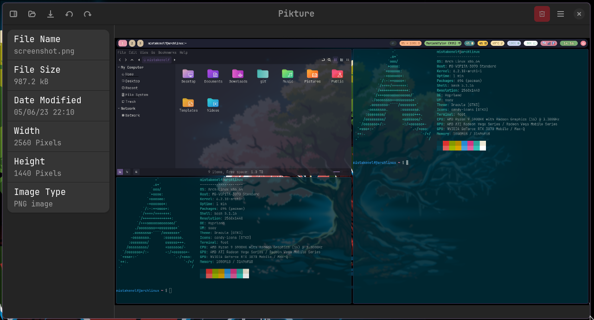

# Pikture

A simple image viewer



# Installation

## Arch

```
yay -S pikture-git
```

# Local Development

## Building

```sh
meson setup build --prefix=/usr
ninja -C build
./build/pikture
```

### Build Flatpak

```
flatpak-builder build com.github.mistakenelf.pikture.yml --user --install --force-clean
```

## Updating translations

```
ninja com.github.mistakenelf.pikture-update-po
```
